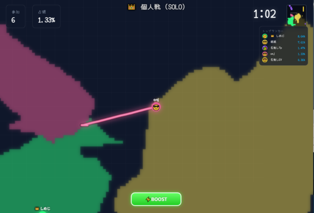

# Zinti - マルチプレイヤー陣取りゲーム

リアルタイムマルチプレイヤーの陣取りゲームサーバー＆クライアント。
WebSocket による低遅延通信と HTML5 Canvas によるレンダリングで動作する。

## ゲーム画面



## 構成

```
zinti/
├── server.v5.js              # メインサーバー（エントリーポイント）
├── msgpack.js                # MessagePack シリアライズ
├── modules/
│   ├── config.js             # 共有設定・定数・状態管理
│   ├── api.js                # HTTP API & 静的ファイル配信
│   ├── game.js               # ゲームロジック・ラウンド管理
│   ├── network.js            # WebSocket 接続・ブロードキャスト
│   ├── stats.js              # 統計収集・DB保存
│   ├── cpu.js                # CPU（AI）プレイヤー制御
│   ├── admin-auth.js         # 管理者認証・セッション管理
│   └── bot-auth.js           # Bot対策キャプチャ認証
├── public_html/
│   ├── index.html            # ゲーム画面
│   ├── admin.html            # 管理パネル
│   ├── admin-login.html      # 管理者ログイン
│   ├── style.css             # スタイルシート
│   └── client/
│       ├── client-config.js  # クライアント設定・グローバル状態
│       ├── client-network.js # WebSocket 通信処理
│       ├── client-game.js    # ゲーム描画・入力処理
│       └── client-ui.js      # UI 管理
├── sql/
│   ├── setup_db.sql          # DB スキーマ（テーブル・ビュー）
│   └── add_round_stats.sql   # 統計テーブル追加
├── docs/                     # プロトコル仕様書等
├── server-credentials.json   # MySQL 接続情報（※git管理外）
└── admin-credentials.json    # 管理者アカウント情報（※git管理外）
```

## 動作環境

| 項目 | 要件 |
|------|------|
| Node.js | v22 以上 |
| MySQL | 8.x（utf8mb4） |
| OS | Linux 推奨 |
| ポート | 2053（HTTPS/WSS） |

## 依存モジュール

| パッケージ | 用途 |
|-----------|------|
| `ws` | WebSocket サーバー |
| `mysql2` | MySQL 接続（Promise対応） |
| `mysql` | MySQL 接続（レガシー互換） |

## セットアップ

### 1. リポジトリのクローン

```bash
git clone <repository-url>
cd zinti
```

### 2. 依存パッケージのインストール

```bash
npm install ws mysql mysql2
```

### 3. データベースの準備

MySQL にデータベースとテーブルを作成する。

```bash
mysql -u root -p < sql/setup_db.sql
mysql -u root -p jintori < sql/add_round_stats.sql
```

### 4. 認証情報ファイルの作成

**server-credentials.json**（MySQL接続情報）:

```json
{
  "mysql": {
    "host": "localhost",
    "user": "your_db_user",
    "password": "your_db_password",
    "database": "jintori",
    "connectionLimit": 5
  }
}
```

**admin-credentials.json**（管理者アカウント）:

```json
{
  "admin": "<SHA-256ハッシュ化パスワード>"
}
```

### 5. SSL証明書の配置（本番環境）

```
/var/www/sites/nodejs/ssl/<domain>/pkey.pem
/var/www/sites/nodejs/ssl/<domain>/cert.pem
```

SSL証明書がない場合は HTTP にフォールバックする。

### 6. サーバー起動

```bash
# 通常起動（ソロモード）
node server.v5.js

# チームモード
node server.v5.js team

# デバッグモード
node server.v5.js debug
```

起動後 `https://<host>:2053` でアクセス可能。
